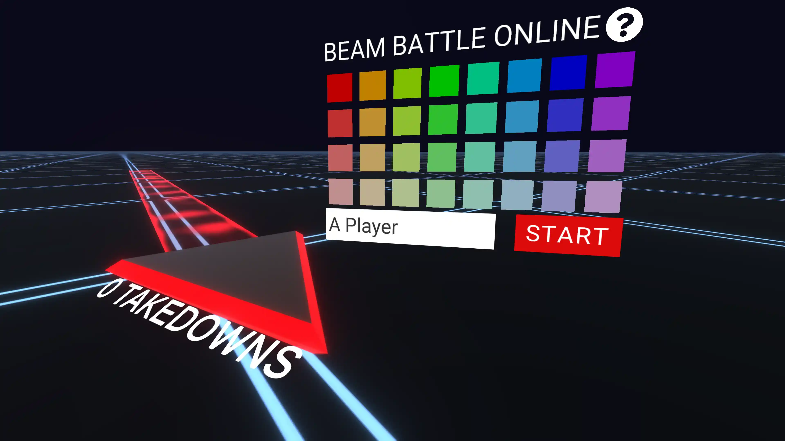
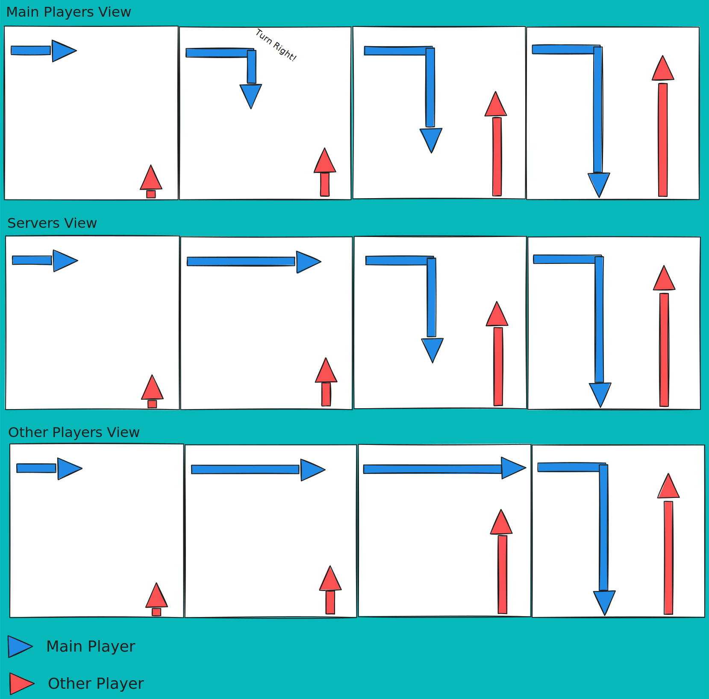
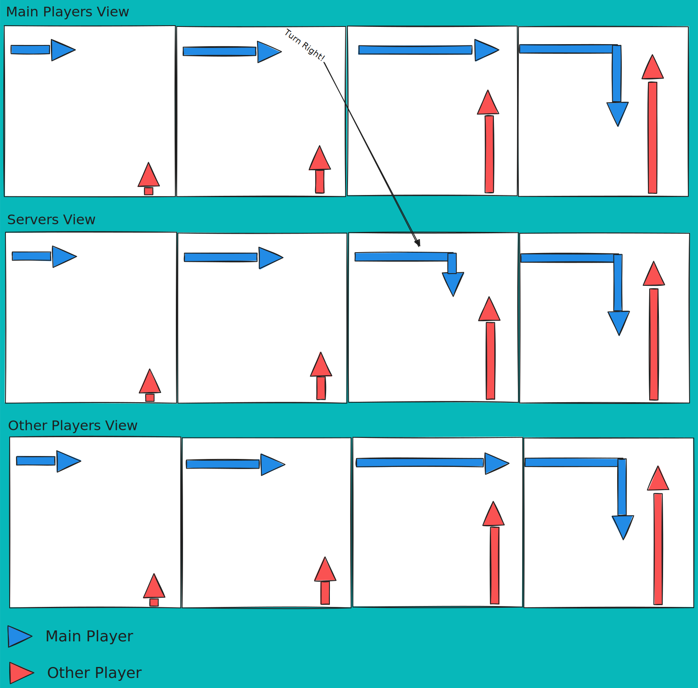

# Server Authority / Beam Battle Online

## What is it?

Beam battle online is an online _multiplayer_ battle royale I made that you can play in your browser! You can play the game [here](https://www.robertaron.io/BeamBattleOnline/), and also check out the [source code on github](https://github.com/RobertAron/BeamBattleOnline).

{/* prettier-ignore */}
<></>

:::info

If you fire up the game randomly you'll likely only be playing with bots. Fire up some extra browser tabs or invite some friends to really check it out!

:::

Here are some interesting thing I learned while making the game!

## Who has the Authority?

When I made the game I hadn't had actual experience in the industry. I decided that I wanted to make the game completely server authoratative...which in hindsight I think was a mistake.

While I'm pretty proud of the fact that the game is super secure, a _huge_ amount of complexity into making it. I would've finished the game much faster if I had gone without it.

### Client Authority

It's hard to say what is a "normal" way to make an online game, but there are a lot of games which put a lot of faith in the game client to make decisions. It's not uncommon for the game running on your computer to be the authority of the x,y,z position of your character. Hackers try to take advantage of this by using tools by modifying their game client.

{/* prettier-ignore */}
<></>

Beam Battle Online, and uses Unity's `UNet` system. In `UNet`, there is a really big push for the player to have authority over their own state. Here's short quote from the docs.

> #### Local authority
>
> You can choose to make the player GameObjects have `local authority`... This is particularly useful for controlling movement; it means that each client has authority over how their own player GameObject is being controlled.

If I had implemented the game this way, the game control might've looked like this.

{/* prettier-ignore */}
<></>

### Server Authority

Instead of allowing user's to update certain values directly, I only gave users access to what `UNet` calls `[Command]`s. These are functions that users are allowed to call on the server. If you're more familiar, these are basically remote procedure calls (`RPC`). You might even consider them something like a `REST` enpoint. Here's a snippet of what I allowed the players to call:

```cs
public class PlayerInputCommunicator : NetworkBehaviour {
  [Command]
  void CmdTurnPlayer(bool left)
  {
    if (bikeMovement != null) bikeMovement.Turn(left);
  }
  [Command]
  void CmdSetPlayerSettings(string name, Color accentColor){
    playerName = name;
    this.accentColor = accentColor;
  }
  [Command]
  void CmdSetPlayerBoost(bool boost){
    if (bikeMovement != null)  bikeMovement.SetBoost(boost);
  }
}
```

This is what the flow looks like using this method:

{/* prettier-ignore */}
<></>

## Comparing Archetectures

| 👍Client Authoratative                   | 👍Server Authoratative         |
| ---------------------------------------- | ------------------------------ |
| Feels better to play                     | Harder to cheat                |
| Easier to implement (At least in `UNet`) | Oponents can't teleport around |

### Picking server Authority

When I first started the project I was pretty focused on making the game "fair". If you have an unstable connection in the client authoratative aproach you have a pretty big advantage. Even if you aren't cheating, with a bad connection you still pretty much have full control over avoiding obsatacles. Even if you have smoothing on player's positions, oponents will see you teleporting as you sporadically update your game state.

### Picking Client Authority

Even though server authority is more fair, it's not more fun. The way a game feels to play is super important. There's a reason why services like Stadia have struggled in the market.

{/* prettier-ignore */}
<></>

## Conclusion

It's hard to know what the right amount of authority to give to your clients. It's was a noble goal to try to make the game as fair as possible. Deciding on the right authority depends a lot on the game you're trying to make.

Everyone wants their game to be fair. Specifically for games though, it's more important that it's _more fun_ than _fair_.

For this game if I were to do it again I would've definietly made the game more client authoratative. The game would've been much faster to make, and probably more fun if I had started by trusting the game clients a little more.
