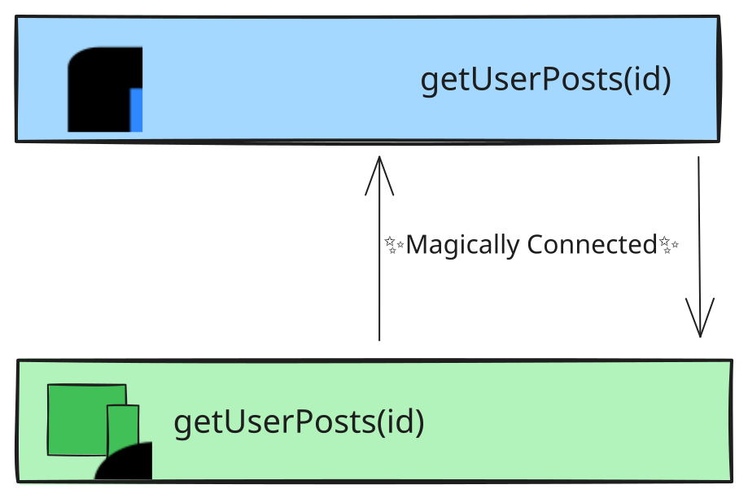
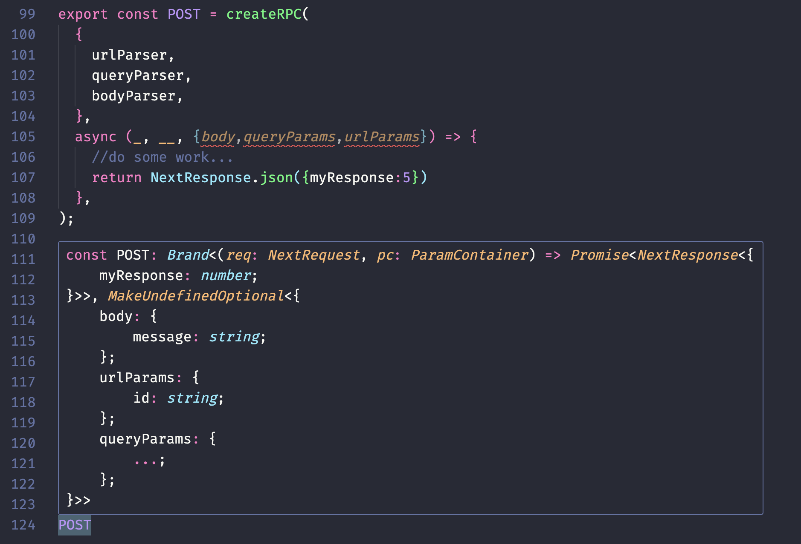
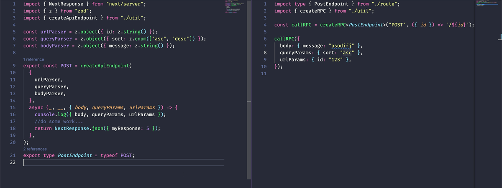

# Build your own Typescript RPC

## What are RPCs

### Difficulty of raw network calls

Pretty much everyone building web applications knows the pain of trying to connect two different applications together. There are so many little things that have to line up correctly when trying to make the request not return that **_damn 4XX_** return code. There are so many things to juggle when trying to get everything aligned up correctly.

- Getting the right URL params
- Setting the right query params
- Sending the right request verb
- Knowing what parameters are available **_to send_**
- Knowing what parameters are available **_to receive_**

On top of this many applications are under constant development. Versioning APIs with backwards compatibility is a lot of work, and sometimes not even possible. It's too easy to make a backend change and miss some frontend thing that needs to change too. That's where RPCs come in.

### Introducing RPCs

**Remote Procedure Calls** is a fancy way to say that you're abstracting away the raw networking code, and replacing it with something that looks more like a normal function.



The difficulty is figuring out how to get the two different computers to _know automatically_ how to talk to each other. There are a ton of different ways of getting the two interfaces to talk to each other. In (the now deprecated) network component for unity, the compiler is able to look at the types and figure decide internally on how the network calls should be made!

```cs
[Rpc(SendTo.Server)]
public void PingRpc(int pingCount) { /* ... */ }

[Rpc(SendTo.NotServer)]
void PongRpc(int pingCount, string message) { /* ... */ }
```

We're talking about typescript though! There are a ton of options out there. For example here are a few popular ones:

| RPC Tool         | Language Support       | Description                                                                                                                                                                                         |
| ---------------- | ---------------------- | --------------------------------------------------------------------------------------------------------------------------------------------------------------------------------------------------- |
| graphQL          | Wide language support. | Made by facebook. Enables requests that arguably _too_ flexible.                                                                                                                                    |
| gRPC             | Wide language support. | Made by google. Serializes using `protobuf` which can be challenging to use.                                                                                                                        |
| tRPC             | Typescript only.       | Made by Alexander Johansson. Probably the most popular typescript SDK.                                                                                                                              |
| Hono RPC         | Typescript Only.       | Created by Yusuke Wada. Built on web standards ([`Response`](https://developer.mozilla.org/en-US/docs/Web/API/Response) and [`Request`](https://developer.mozilla.org/en-US/docs/Web/API/Request)). |
| server functions | React Only.            | Made by facebook. Super great with react, but requires a bundler like NextJS that's really built for making these                                                                                   |

:::info

Also as an honorable mention `OpenAPI` is a way to define your API that has a [huge number of tools](https://openapi.tools/) built around it.

:::

### Why build your own custom RPC.

Your team will probably hate you if you roll your own RPC tooling. Still though - I think it's not a bad idea to understand how it works. There's a lot to be learned about how typescript tricks that to be learned. Additionally, you might find yourself in a situation where you run across a unique situation where you gotta build it yourself! For example if you wanted to use something like [server sent events](https://developer.mozilla.org/en-US/docs/Web/API/Server-sent_events) the above may not support that specific feature.

## Getting started!

First let's layout the requirements:

- Typescript Enforced
- No server code should be packaged onto the client
- Requests are validated
- Uses web standards
- Integrates with NextJS

### Server Side!

#### Desired interface

Ok lets start with a rough outline of what we want generating an RPC to look like. Our example endpoint will make a new note for a user, and return back the notes they currently have.

```ts
import { createApiEndpoint } from "custom-rpc";
import { z } from "zod";

const urlParser = z.object({ id: z.string() });
const queryParser = z.object({ sort: z.enum(["asc", "desc"]) });
const bodyParser = z.object({ message: z.string() });

export const POST = createApiEndpoint(
  {
    urlParser,
    queryParser,
    bodyParser,
  },
  ({ url, query, body }) => {
    //do some work...
    return notes;
  },
);
```

#### Things we need to gather

Ok so we know what we want our tool to look like, but now how do we define `createApiEndpoint`? Well there is a ton of generic things we'll need to infer the type of. Lets make a list...

- urlParser
- queryParser
- bodyParser
- callback result

#### Typescript magic

Here comes the pretty weird part. The result from this method is going to have the shape `(req: NextRequest, pc: ParamContainer) => NextResponse`. This sucks for us, because we _need_ the types, but we also need the this function signature. In order to get the type **_and_** encode the meta data we need we'll use branding!

```ts
declare const __Brand: unique symbol;
type BrandProperty<B> = { [__Brand]: B };
export type Brand<T, B> = T & BrandProperty<B>;
export type ExtractBrand<T> = T extends BrandProperty<infer B> ? B : never;
```

This post is already pretty long so I'm going to skip past this, but you can read more about how this works [here](https://egghead.io/blog/using-branded-types-in-typescript).

#### Finally building our utility

```ts
// Type of NextJS url params
type ParamContainer = { params: Promise<unknown> };

// Type that enables optional zod input
type OptionalParser = z.ZodType | undefined;

// Utility to get what the result of parsing an optional parser should be
type Parsed<T extends OptionalParser> = 
  T extends z.ZodType ? z.infer<T> : 
  T extends undefined ? undefined : 
  never;

// Enable a value, or a response resolving in a value
export type MaybePromise<T> = T | Promise<T>;

/**
 * Convert types like
 * ```ts
 * type Thing = {hm: number|undefined}
 * // into
 * type Thing = {hm?:number|undefined}
 * ```
 */
export type MakeUndefinedOptional<T> = {
  [K in keyof T as undefined extends T[K] ? K : never]?: Exclude<T[K], undefined>;
} & {
  [K in keyof T as undefined extends T[K] ? never : K]: T[K];
};

// This method creates the endpoint. It returns a function.
export function createApiEndpoint<
  X extends any,
  T extends OptionalParser = undefined,
  U extends OptionalParser = undefined,
  V extends OptionalParser = undefined,
>(
  validators: {
    bodyParser?: T;
    urlParser?: U;
    queryParser?: V;
  },
  cb: (
    req: NextRequest,
    pc: ParamContainer,
    parsed: {
      body: Parsed<T>;
      urlParams: Parsed<U>;
      queryParams: Parsed<V>;
    },
  ) => MaybePromise<NextResponse<X>>,
) {
  // This method handles the params parsing, and callback calling
  const apiCallback = async (req: NextRequest, pc: ParamContainer) => {
    // only await the content of these parameters if we are going to validate them.
    const jsonRawPromise = validators.bodyParser
      ? req.json()
      : Promise.resolve(undefined);
    const paramsRawPromise = validators.urlParser
      ? pc.params
      : Promise.resolve(undefined);
    const [jsonRaw, paramsRaw] = await Promise.all([
      jsonRawPromise,
      paramsRawPromise,
    ]);

    const searchRaw = validators.queryParser
      ? Object.fromEntries(new URL(req.url).searchParams.entries())
      : undefined;
    // Bundle all our data
    const parsed = {
      body: validators.bodyParser?.parse(jsonRaw),
      urlParams: validators.urlParser?.parse(paramsRaw),
      queryParams: validators.queryParser?.parse(searchRaw),
    };
    // call the actual callback
    return await cb(req, pc, parsed);
  };

  // return the callback, with the extra types branded onto it!
  return apiCallback as Brand<
    typeof apiCallback,
      MakeUndefinedOptional<{
        body: Parsed<T>;
        urlParams: Parsed<U>;
        queryParams: Parsed<V>;
      }>
  >;
}
type CreatedApi = ReturnType<typeof createApiEndpoint>;

```

#### Finishing up the server side

Ok... now that we've built that insanity, lets look at how to use it!




Not bad! And the result is some kind of black magic.

Everything is now encoded that we need to call the method!...now how do we get it out?

### The client

Ok! moving onto the client there's a few things we have left to setup. Unfortunately with how nextjs works, we aren't able to encode the URL or the method type directly into the method in a type enforceable way. Plus we're only going to import types from the file above, so we can't import a string or anything like that. We'll leave those parts up to the client. So our imagined interface will be like this...

```ts
const callMyEndpoint = createRPC<PostEndpoint>("POST",({id})=>`/${id}`)

callMyEndpoint({
  urlParams: { id: "1"}
  query: { sort: "asc" }
  body: { message: "" }
})
```

First the is the method type. Pretty straight forward. 

Next is the URL. Now, the URL could be dynamic, and that's one of our first uses of pulling out content from our defined API. With the way these types are setup, the url can be static if we have parameters for the URL, _**but**_ if there are URL params, we'll need a callback to generate the URL.

Finally, we've generated our RPC, and we just need to call it!


#### Building the utility

```ts

type ExtractResponse<T> = T extends (
  ...args: any[]
) => MaybePromise<NextResponse<infer U>>
  ? U
  : never;
type CreatedApi = ReturnType<typeof createApiEndpoint>;
type MethodTypes =
  | "GET"
  | "POST"
  | "DELETE"
  | "PUT"
  | "PATCH"
  | "HEAD"
  | "OPTIONS";
export function createRPC<T extends CreatedApi>(
  method: MethodTypes,
  // url must be calculated via params when using urlParams
  url: ExtractBrand<T>["urlParams"] extends undefined
    ? string
    : (urlParams: ExtractBrand<T>["urlParams"]) => string,
) {
  type Request = ExtractBrand<T>;
  type Response = Promise<ExtractResponse<T>>;
  const dynamicUrl = typeof url !== "string";
  return async function rpc(req: Request) {
    const prefix = dynamicUrl ? url(req.urlParams) : url;
    const postfix = req.queryParams !== undefined ? `?${new URLSearchParams(req.queryParams)}` : "";
    const fetchResponse = await fetch(`${prefix}${postfix}`, {
      method,
      body: JSON.stringify(req.body),
      headers: {
        "Content-Type": "application/json",
      },
    });
    if (!fetchResponse.ok) {
      const error = await fetchResponse
        .text()
        .catch(() => fetchResponse.statusText);
      throw new Error(error);
    }

    return fetchResponse.json() as Response;
  };
}
```

Ok...not pretty. How's it working though?

### Results




Pretty nice! Now any changes on the backend will show on the frontend what's required. The results come back correctly. No more 400 errors!

Now...thi isn't a perfect solution. We could still run into 404 errors. NextJS' endpoints are file based, so it's pretty hard to encode that into a type system.

Still though this can get you pretty far! With only around 200 lines of (pretty terse) code you can get almost all the same benefits you would from a much larger library.

