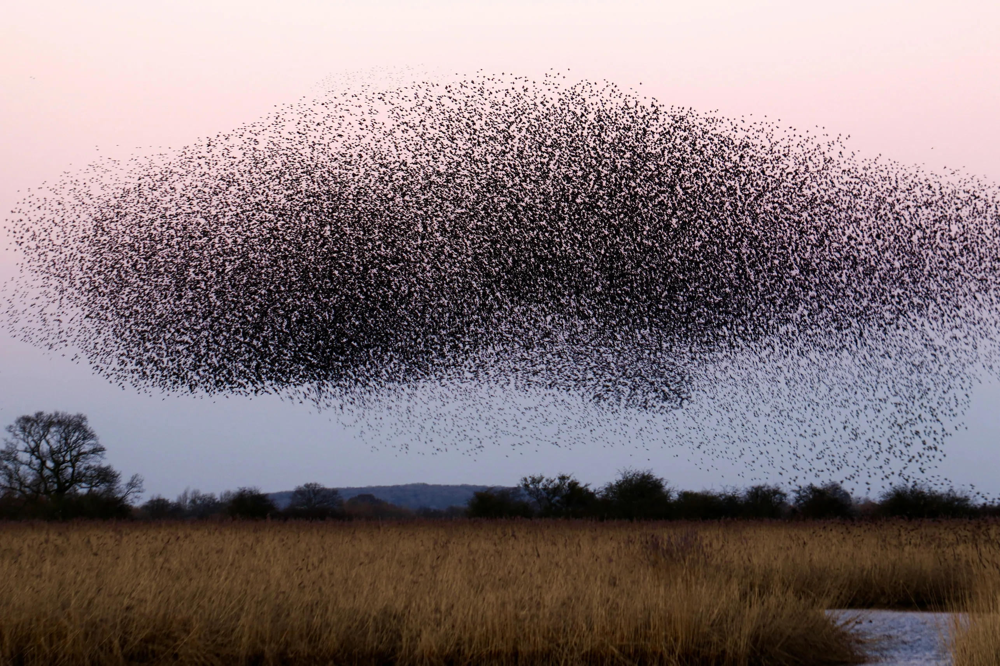
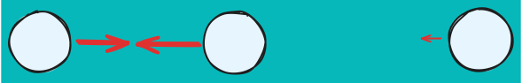
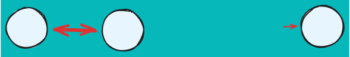
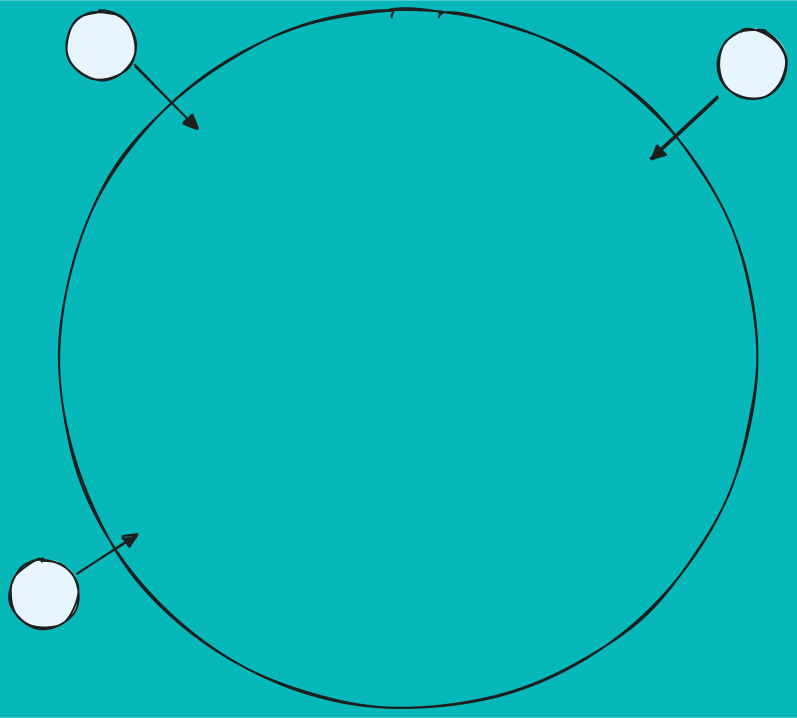

import { BoidsEntrypoint } from "./_boids/BoidsEntrypoint";
import { SkipForward } from "lucide-react"; 

# Fish Simulator (boids)

[<SkipForward className="h-4"/> Skip to results](#show-me-the-results)

## What are Boids?

Boids refers to a way to simulate how animals move to together in groups. Specifically, it's usually used in references to fishes or birds. Basically - it's how birds flock.

{/* prettier-ignore */}
<></>

## The Rules of Boids

There are only three forces neccsairy for implementing boids, so it's not to hard to build from scratch.

### Force #1 Cohesion

Boids tend to want to clump together. You can think of this force a little like gravity or magnets. The closer the boids are together, the stronger this force becomes.

{/* prettier-ignore */}
<></>

```ts
const tempCohesion = new THREE.Vector3(0, 0, 0);
/**
Mutates a vector. Applies a force that pushes fish together.
*/
function cohesionForces(
  inVec: THREE.Vector3,
  fish: Fish,
  nearbyFish: Fish[],
  centerOfMassForceScaling = 0.8,
) {
  if (nearbyFish.length === 0) return;
  // combined locations
  tempCohesion.set(0, 0, 0);
  for (const otherFish of nearbyFish) {
    tempCohesion.add(otherFish.velocity);
  }
  // average location
  tempCohesion.multiplyScalar(1 / nearbyFish.length);
  // vector to center of mass
  tempCohesion.sub(fish.threeObj.position).normalize();
  // applied scaling
  tempCohesion.multiplyScalar(centerOfMassForceScaling);
  inVec.add(tempCohesion);
}
```

### Force #2 Separation

Boids _do not_ want to colide with one another. Thinking about animals this makes a lot of sense. Crashing into your friends isn't fun. You want to be around them, but not actually hit them!

As two boids get close to one other there should be a repelling force between them. This force should scale such that the two elements (typically) don't colide with one another.

{/* prettier-ignore */}
<></>

```ts
const tempSeparation = new THREE.Vector3(0, 0, 0);
const tempSeparationSum = new THREE.Vector3();
/**
Mutates a vector. Applies a force that pushes fish away from each other.
 */
function applySeparationForces(
  inVec: THREE.Vector3,
  fish: Fish,
  nearbyFish: Fish[],
  separationScaling = 0.1,
) {
  tempSeparationSum.set(0, 0, 0);
  for (const otherFish of nearbyFish) {
    // vector pointing from other fish towards main fish
    tempSeparation
      .copy(fish.threeObj.position)
      .sub(otherFish.threeObj.position);
    // when distance is small, this number gets really high
    const inverseDistance = 1 / tempSeparation.length();
    // applied force
    tempSeparation.multiplyScalar(inverseDistance * separationScaling);
    tempSeparationSum.add(tempSeparation);
  }
  inVec.add(tempSeparationSum);
}
```

### Force #3 Alignment

In my opinion this is the most complicated force. This one aligns the motion of boids with one another. The boids will tend to steer in a similar direction to keep themselves moving in a similar direction.

{/* prettier-ignore */}
<></>

```ts
const tempAlignmentDirection = new THREE.Vector3();
/**
Mutates a vector. Add forces that align with other forces.
 */
function alignmentForces(
  inVec: THREE.Vector3,
  nearbyFish: Fish[],
  forceScaling = 6,
) {
  tempAlignmentDirection.set(0, 0, 0);
  for (const otherFish of nearbyFish) {
    tempAlignmentDirection.add(otherFish.velocity);
  }
  tempAlignmentDirection.normalize();
  inVec.add(tempAlignmentDirection.multiplyScalar(forceScaling));
}
```

## Implementation Gotchas

Now that conceptually we know what makes up boids lets fill in a few gaps when it comes to implementation.

### Container Force

Without some kind of aditional forces in play it's pretty likely we'll make a groups of boids that fly off into the distance.
For my implementation I'll keep it simple. There will be a sphere that pushes the little fishies back together if they get too far away from the center.

{/* prettier-ignore */}
<></>

### Instancing

Now we're getting into some optimization type things. If we want more than a few fish swimming around we're going to want to instance them. Instancing is a technique you can use when you have a _bunch_ of objects that all have really similar attributes. Typically it's used for things like grass. I won't pretend to fully understand what it's doing under the hood, but it reduces the number of draw calls that need to be made...whatever that means.

Basically, it'll make the GPU go *blazingly fast*™️

### Spacial Partitioning

Ok last part before we implement this. If we make a bunch of fish we're going to run into another performance issue. Each of the fish applies forces on each other.

If we have 10 fish that's not a big deal. We'll need to run 100 calculations to calculate all the forces needed. This doesn't scale well though. It's n<sup>2</sup>. If we want 1000 fish, that'll be 1,000,000 comparisons 🤢

Even though this is the worst case scenario we can improve the adverage complexity a lot of if have some distance where the boids no longer effect one another. If they're far enough apart, we can utilize spacial partitioning.

:::warning

This wont help with the _worst_ case scenario. If all the boids are stacked on top of each other, you'll still end up doing the worst case calculation. The nature of boids keeps this from happening though, so _most_ of the time this shouldn't come up.

:::

If we define our forces in a way that they drop to 0 when further than 10 meters apart, then we wont have to run as many calculations. But how do we know which boids are close and which are far? We'll that's what we'll use spacial partitioning for. It will help give us hints as to which boids have the possibility of being next to each other.

We break our coordinates up into grids of 10 units. Boids in one grid could be within 10 meters of boids in the adjacent grids, but not the ones further than that. Here's what that looks like:

{/* prettier-ignore */}
<></>

In the above diagram...

- 🔵 The blue dot is the current boid we are calculating the force for
- 🟡 The yellow dots are boids that could be under 10 metters away
- 🔴 The red dots are boids that aren't in adjacent grid tiles, so we know they're greater than 10 meters away.

Ok so lets look at the typescript. Franky, it's pretty confusing. There's no getting around it.

```ts
const bucketValue = (value: number, floorTo: number) =>
  Math.floor(value / floorTo);

/**
Use Spacial Partitioning to find which fish are near each other
 */
function createNearbyGraph(allFish: Fish[], distance: number) {
  // Maps are slightly faster for iterating through all members
  const bucketedFish = new Map<string, number[]>();
  // Put all fish into their buckets
  for (let i = 0; i < allFish.length; i++) {
    const fish = allFish[i];
    const group = fish.threeObj.position
      .toArray()
      .map((positionComponent) => bucketValue(positionComponent, distance))
      .join(":");
    if (!bucketedFish.has(group)) bucketedFish.set(group, [i]);
    else bucketedFish.get(group)?.push(i);
  }

  // this is the end goal. return a 2d array. 1st index is the fish id which returns a list of fish(index) that are nearby
  const nearbyLookup: number[][] = Array.from(Array(allFish.length), () => []);

  for (const fishInCurrentBucket of bucketedFish.values()) {
    // Make a list of all fish within this bucket, and adjacent buckets
    const fishesIndexWithinAdjacentBuckets: number[] = [];
    const bucketIndexes = allFish[fishInCurrentBucket[0]].threeObj.position
      .toArray()
      .map((component) => bucketValue(component, distance));
    for (let x = bucketIndexes[0] - 1; x <= bucketIndexes[0] + 1; x++) {
      for (let y = bucketIndexes[1] - 1; y <= bucketIndexes[1] + 1; y++) {
        for (let z = bucketIndexes[2] - 1; z <= bucketIndexes[2] + 1; z++) {
          const bucketKey = `${x}:${y}:${z}`;
          const bucketValues = bucketedFish.get(bucketKey) ?? [];
          fishesIndexWithinAdjacentBuckets.push(...bucketValues);
        }
      }
    }

    // For the current fish, go through all fish that are potentially nearby.
    // If they are within the distance, add them to the list of nearby fish.
    for (const currentFishIndex of fishInCurrentBucket) {
      const currentFish = allFish[currentFishIndex];
      for (const potentiallyNearbyFishIndex of fishesIndexWithinAdjacentBuckets) {
        // can't be near yourself
        if (currentFishIndex === potentiallyNearbyFishIndex) continue;
        const otherFish = allFish[potentiallyNearbyFishIndex];
        const isNearby =
          currentFish.threeObj.position.distanceTo(
            otherFish.threeObj.position,
          ) < distance;
        if (isNearby)
          nearbyLookup[currentFishIndex].push(potentiallyNearbyFishIndex);
      }
    }
  }
  return nearbyLookup;
}
```

## Show me the results!

For my implementation I'll be using [`react three fiber`](https://github.com/pmndrs/react-three-fiber). It's a way to tie together `react.js` and `three.js`

<BoidsEntrypoint />

A little bit off topic but I find it super mezmerizing to look at them swim around. It looks _super_ crisp. I think it's because we live in a world of streaming. Streaming compression doesn't lend itself very well to confetti flying around everywhere. If you try and stream something like that it gets super blurry. At least for me, being conditioned to that quality and then looking at this makes it look unbelievably crisp.
