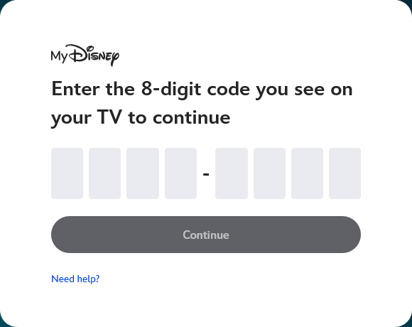
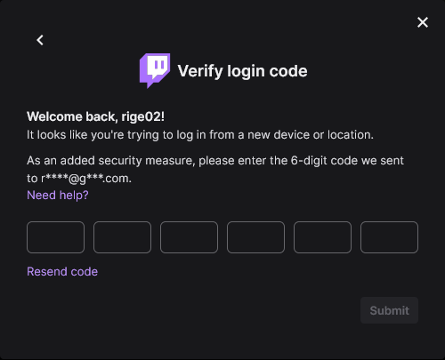

# OTP Inputs

## Setting the stage

Have you ever gotten one of those security tests where they send you a text? While logging into a site you'll recieve a message with the following:

> We just sent you a text! Insert the security input below.

They usually come hand-in-hand with this super unique input type where you can only type one character at a time! Here are some of the big tech sites using them.




## What's the purpose?

They look cool! More importantly though they help match the code they recieved into the input. Just like when you're a kid playing with those block toys where you need to slot the right shape into the right hole.

## Unique Behaviors

Since this isn't a normal input type there are some things weird things that need to be fixed. Users wont want to manually focus each input, so we'll need to handle that for them. Here are some behaviors to consider.

- Typing one character at a time
- Back spacing if they make a typo
- Copy/Pasting their input

## Implementing!

I'm sure there's a bunch of ways to implement this but here's what I came up with

#### HTML

Put in a bunch of inputs. Here I'm using a fieldset to notate that all of these inputs are grouped together.

```html
<fieldset class="number-code">
  <legend>Security Code</legend>
  <div>
    <input name="code" class="code-input" required />
    <input name="code" class="code-input" required />
    <input name="code" class="code-input" required />
    <input name="code" class="code-input" required />
    <input name="code" class="code-input" required />
    <input name="code" class="code-input" required />
  </div>
</fieldset>
```

I also give them all the same name, that way it's easy to collect the data when the form gets submitted

```js
function onSubmit(e) {
  e.preventDefault();
  const code = inputElements.map(({ value }) => value).join("");
  console.log(code);
}
```

#### Javascript

Ok the behavior code looks a bit scary. It's not too bad though. There are two key overrides that are setup.


_User hits backspace_
- If the current input already has text in it, just let the event go as normal!
- If there's no content in this input, focus the previous element. This focus actually occrus _before_ removing the character. That means if you backspace in the empty input, the previous character will be removed.

_User inputs text_
1. Insert the first character of the user action into the input.
2. Focus the next element. Fire off a new input event with the _rest_ of the characters.

If a user types one key it will just highlight the next input. If they input a bunch of characters via a copy/paste it will set off a chain reaction until theres no more characters.

```js
const inputElements = [...document.querySelectorAll("input.code-input")];
inputElements.forEach((ele, index) => {
  ele.addEventListener("keydown", (e) => {
    // if the keycode is backspace & the current field is empty
    // focus the input before the current. Then the event happens
    // which will clear the "before" input box.
    if (e.keyCode === 8 && e.target.value === "")
      inputElements[Math.max(0, index - 1)].focus();
  });
  ele.addEventListener("input", (e) => {
    // take the first character of the input
    // this actually breaks if you input an emoji like 👨‍👩‍👧‍👦....
    // but I'm willing to overlook insane security code practices.
    const [first, ...rest] = e.target.value;
    e.target.value = first ?? ""; // first will be undefined when backspace was entered, so set the input to ""
    const lastInputBox = index === inputElements.length - 1;
    const didInsertContent = first !== undefined;
    if (didInsertContent && !lastInputBox) {
      // continue to input the rest of the string
      inputElements[index + 1].focus();
      inputElements[index + 1].value = rest.join("");
      inputElements[index + 1].dispatchEvent(new Event("input"));
    }
  });
});
```

## Result

Check out the final result! Make sure to try out all the behaviors yourself.

<iframe
  height="750"
  scrolling="no"
  title="Multi / Separated Input Verification Code"
  src="https://codepen.io/RobertAron/embed/gOLLXLo?default-tab=result"
  frameBorder="no"
  loading="lazy"
  allowtransparency={"true"}
  allowFullScreen
  className="w-full"
>
  See the Pen{" "}
  <a href="https://codepen.io/RobertAron/pen/gOLLXLo">
    Multi / Separated Input Verification Code
  </a>{" "}
  by Robert Aron (<a href="https://codepen.io/RobertAron">@RobertAron</a>) on{" "}
  <a href="https://codepen.io">CodePen</a>.
</iframe>
