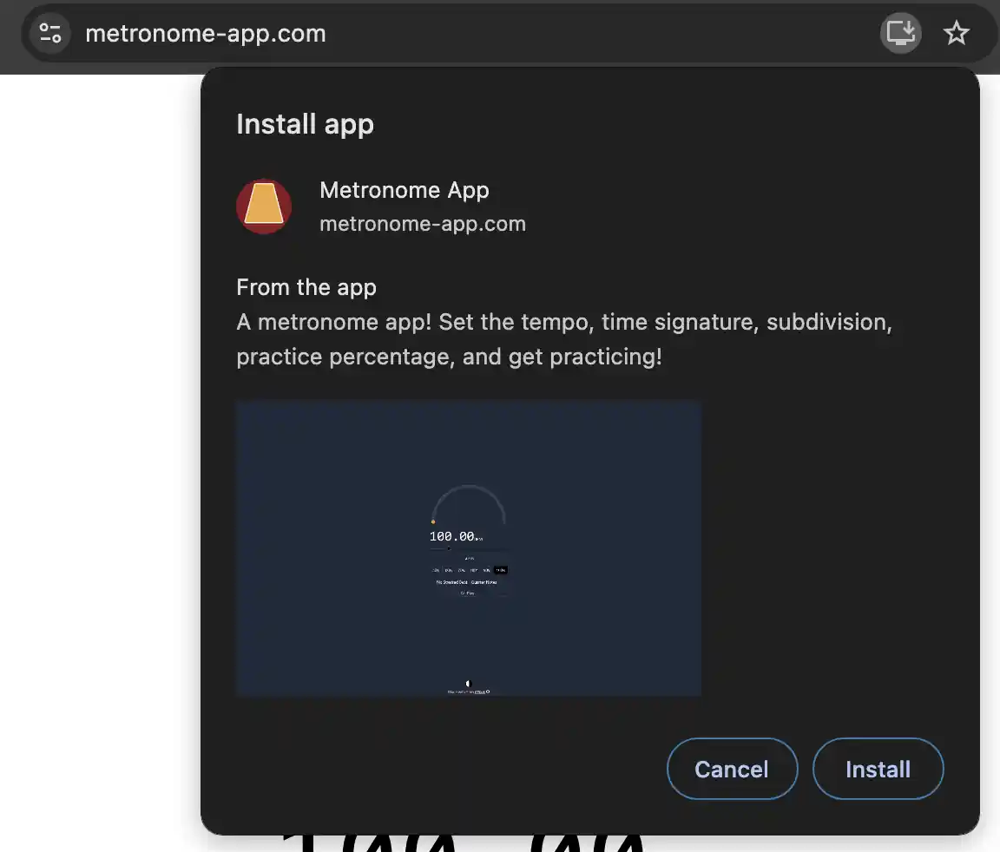
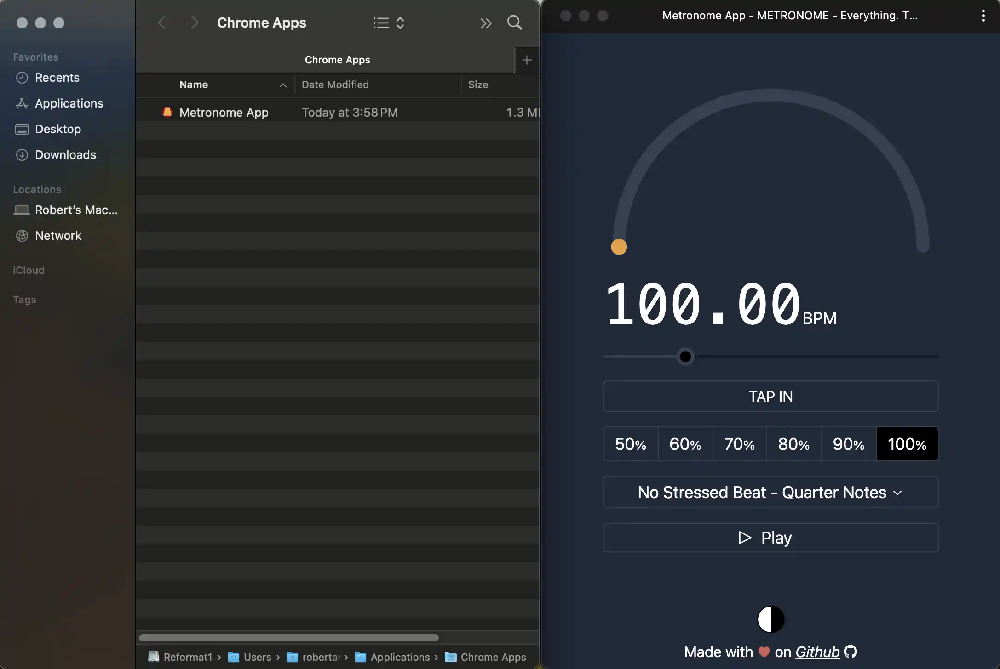
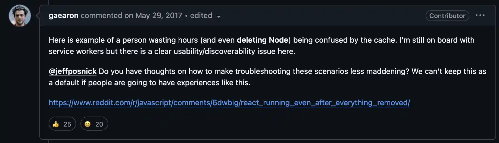

# PWAs in 2024

Some quick acronyms!
|Acronym|	Meaning|
| -------- | --------------------------- |
| PWA      | Progressive Web Application |
| SPA      | Single Page Application     |
| CRA      | Create React App            |

## The Promise of PWAs

Progressive Web Applications (PWAs) are an intriguing part of the web that, despite their potential, haven't quite taken off. The idea behind PWAs is to provide a more "native application" experience directly through your web browser. In a perfect world, PWAs could replace the need for separate websites and desktop applications.

So, what makes PWAs different from normal web apps? For starters, they can run offline. Once downloaded, a PWA has the ability to work without an internet connection and can even place an app icon right on your computer or phone. When you do reconnect, the app automatically updates itself if there's new content.
{/* prettier-ignore */}
<></>
{/* prettier-ignore */}
<></>

You can transform pretty much any website into a PWA. This is especially beneficial for sites where the core of the app isn't content driven. After the user has downloaded the app, they no longer need to make network requests to load the basic structure of your site. This concept aligns closely with Single Page Applications (SPAs), where the entire application is downloaded initially, and subsequent content is fetched as needed.
## The Challenges Facing PWAs

### _DRAMA!_ PWAs & CRA

In the early days of React, CRA made a strong push for PWAs. However, this led to some confusion among developers. A significant point of contention was the way PWAs handled caching and offline functionality by default.
{/* prettier-ignore */}
<></>

Even when you stop the react dev command line from running, your website will look like it's running. If you're not familiar with PWAs this could be super confusing. This developer apparently uninstalled node to try and stop the application from running! Unbeknownst to them, the app was already installed in their browser's cache. It must have felt like their browser was haunted! 👻

### Corporations' Reluctance

While offline content is great for users, it's not always a win for corporations. If your site relies on serving ads, offline users aren't generating revenue. Although there are workarounds, if your app requires internet connectivity for core features, you lose much of the PWA's benefits. For many Software as a Service (SaaS) platforms, converting to a PWA doesn't offer enough incentive.

### User Adoption Hurdles

In an ideal scenario, PWAs make apps faster and more "native" feeling. But in practice:

- Generally people have decent internet connections.
- If they don't, the app might not function properly anyway.
- 🐥 It's not common because people aren't used to it.
- 🥚 People aren't used to it because it's not common.

## PWAs vs. Electron Apps

Electron apps are everywhere, so you'd think PWAs would be equally popular. Apps like Slack, Discord, and Spotify all have PWAs available... yet they encourage you to use their Electron versions instead.

Electron apps generally have more permissions than web browsers allow. For instance, Discord's screen sharing feature doesn't work in the PWA version.
{/* prettier-ignore */}
<></>

So, PWAs often end up as a half measure that few people use. If you want to try an app without a full installation, you might opt for the website. If you're committed, you'll download the native application. When would you pick a PWA? It's not entirely clear.

## When Does a PWA Make Sense?

Despite the challenges, adding PWA functionality to your app isn't too much extra work. Many teams think:

> Why not? ¯\_(ツ)_/¯

## Conclusion

PWAs aren't harmful and occupy an interesting niche. They can be particularly useful for reaching users on devices like Chromebooks. If your app has a static framework and could benefit from offline capabilities, a PWA might be worth considering.

Implementing a PWA can be a fun project during a creative sprint or hackathon. It allows your team to explore new technologies and potentially tap into a niche market.